## Latency Engineering Plan

### Targets

- TTFW (first audible word): ≤ 500 ms (P50), ≤ 800 ms (P95)
- End‑to‑end (voice→voice) for short utterances: ≤ 1.2 s (P95)

### Baseline vs Optimized Budgets

| Stage | Baseline | Optimized |
| --- | --- | --- |
| ASR | 0.5–1.5 s | 0.2–0.5 s |
| LLM | 1.0–3.0 s | 0.2–0.6 s |
| TTS | 0.5–2.0 s | 0.2–0.5 s |

### Techniques

- Quantization: INT8/INT4 for ASR/LLM; ONNX for TTS
- Smaller models: whisper‑base/small, Mistral/Gemma‑2B, VITS‑lite
- GPU accel when available (e.g., free Colab/Kaggle GPUs for dev/testing); CPU‑only gracefully degraded path
- Streaming everywhere: partial ASR → incremental LLM → streaming TTS
- Co‑location: run all services on one node to avoid network hops
- Caching: warm models; reuse LLM KV‑cache across turns
- Speculative decoding: in vLLM for faster token generation
- Edge inference: offload lightweight tasks (VAD, partial ASR) to client for <100ms gains

### Measurement and Tooling

- Metrics per stage: `*_latency_ms`, token throughput, RTF for TTS
- Profilers: PyTorch Profiler, Nsight, onnxruntime profiling
- Load: Locust/K6 to simulate N sessions; record P50/P95/P99

### Experiments (Ordered)

1. Establish CPU baseline (small models)
2. Enable streaming ASR; measure partial emission latency
3. Switch LLM to llama‑cpp Q4; tune context and sampling; measure tok/s
4. ONNX export for TTS; compare startup latency and RTF
5. GPU path: vLLM for LLM; measure TTFW and tok/s
6. End‑to‑end streaming with phrase‑level TTS chunking

### Risk Controls

- Backpressure queues; drop low‑value partials when congested
- Fallback policies: shrink models when CPU>85% or latency>budget

### Latency Breakdown Diagram

```mermaid
gantt
    title End-to-End Latency Budget (Optimized)
    dateFormat  X
    axisFormat %s

    section ASR
    VAD + Decode :0, 300ms
    section LLM
    Incremental Gen + Speculative :after ASR, 400ms
    section TTS
    Streaming Synth :after LLM, 300ms
    section Total
    TTFW :0, 500ms
    E2E :0, 1000ms
```

