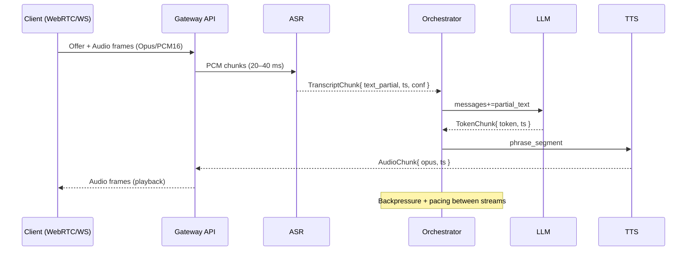

## System Design: Inzwa Realtime Voice Assistant (Python‑Only)

### Overview

The system comprises a Gateway API for ingress/egress, three ML microservices (ASR, LLM, TTS) exposed as Python modules within the same process or as separate processes, and an Orchestrator that manages streaming, state, and safety.

### Deployment Topologies

- Single‑process (dev): all components in one FastAPI app with async tasks
- Multi‑process (prod): separate workers per subsystem communicating via in‑proc async queues or lightweight IPC (ZeroMQ/uvloop pipes); optional Redis for scale‑out
- Single node to start; scale vertically, then horizontally by sharding sessions

### Detailed Sequence (Streaming Voice Turn)

### Interfaces and Schemas

- TranscriptChunk
  - `text`: string
  - `is_final`: bool
  - `start_ms`, `end_ms`: int
  - `confidence`: float (0–1)

- TokenChunk
  - `token`: string
  - `logprob`: float | null
  - `is_final`: bool

- AudioChunk
  - `format`: `opus` | `pcm16`
  - `sample_rate`: int (16000 or 48000)
  - `payload`: bytes (base64 if over WS JSON)

### Public API (Gateway)

- WebSocket `/ws/audio`
  - Client → Server binary messages: PCM16 frames (little‑endian) at 16 kHz, 20–40 ms
  - Client → Server JSON control messages:
    - `{type:"start", session_id, auth_token, codec, sample_rate}`
    - `{type:"end_turn"}`
  - Server → Client JSON events:
    - `{type:"asr.partial", text, start_ms, end_ms, conf}`
    - `{type:"llm.partial", token}`
    - `{type:"tts.start"}` / `{type:"tts.end"}`
  - Server → Client binary: audio frames (Opus/PCM16)

- WebRTC `/rtc/session`
  - SDP offer/answer exchange; audio via SRTP; data channel for JSON events as above

- REST
  - `POST /v1/asr` WAV/PCM → JSON transcript
  - `POST /v1/chat` JSON messages[] → streaming SSE or chunked JSON tokens
  - `POST /v1/tts` text → WAV/Opus stream
  - `GET /v1/models` list available ASR/LLM/TTS models & versions
  - `POST /v1/admin/warmup` pre‑load models into memory

### Concurrency and Backpressure

- Each session has bounded queues: `audio_in`, `transcripts`, `tokens`, `audio_out`
- Orchestrator monitors queue sizes; slows upstream (await) or drops lowest value partials
- TTS pacing: only synthesize when phrase boundary detected or token confidence stable

### Session and State Management

- Session ID is UUIDv4; includes correlation ID for tracing
- Dialogue state stores last N turns, safety flags, locale, voice id
- Garbage collection on idle timeout (e.g., 60 s); graceful teardown

### Error Modes and Recovery

- ASR stall → reset decoder, replay last 500 ms buffer
- LLM timeout → fallback template response, reduce max_new_tokens
- TTS underrun → insert comfort noise or short pause audio frame

### Rate Limiting and Quotas

- Token bucket per API key/user: max concurrent sessions, tok/s, audio mins/day
- Over‑limit yields `429` or negotiated downgrade (smaller models)

### Safety and Guardrails

- Input filters: VAD trims, speech profanity detection (optional)
- Output filters: LLM moderation prompt, regex constraints, allow‑list for sensitive intents
- Conversation policies tuned for Shona cultural norms

### Storage and Caching

- Ephemeral in‑memory buffers during session
- Optional short‑term encrypted blob store for opt‑in feedback and evaluation
- KV‑cache reuse in LLM across turns; warmup on `admin/warmup`

### Scalability Strategy

- Vertical scale: GPU first; pin LLM/TTS to GPU, ASR on CPU
- Horizontal: shard sessions across pods; sticky session via gateway
- Optional Redis for distributing transcripts/tokens; prefer in‑proc queues for latency

### Observability Details

- Prometheus metrics endpoints: `/metrics`
- Example metrics: `inzwa_asr_partial_latency_ms`, `inzwa_llm_ttfw_ms`, `inzwa_tts_rtf`, `inzwa_session_active`
- OpenTelemetry traces: spans per stage with session + turn IDs

### Testing Strategy (System)

- Synthetic end‑to‑end latency tests with prerecorded utterances
- Chaos tests: kill/restart one subsystem during stream; expect graceful recovery
- Load tests: N concurrent sessions with Locust/K6; monitor P95/P99 latencies

